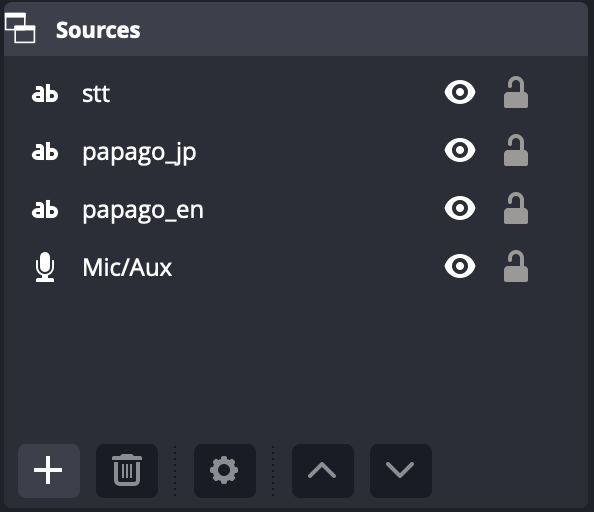
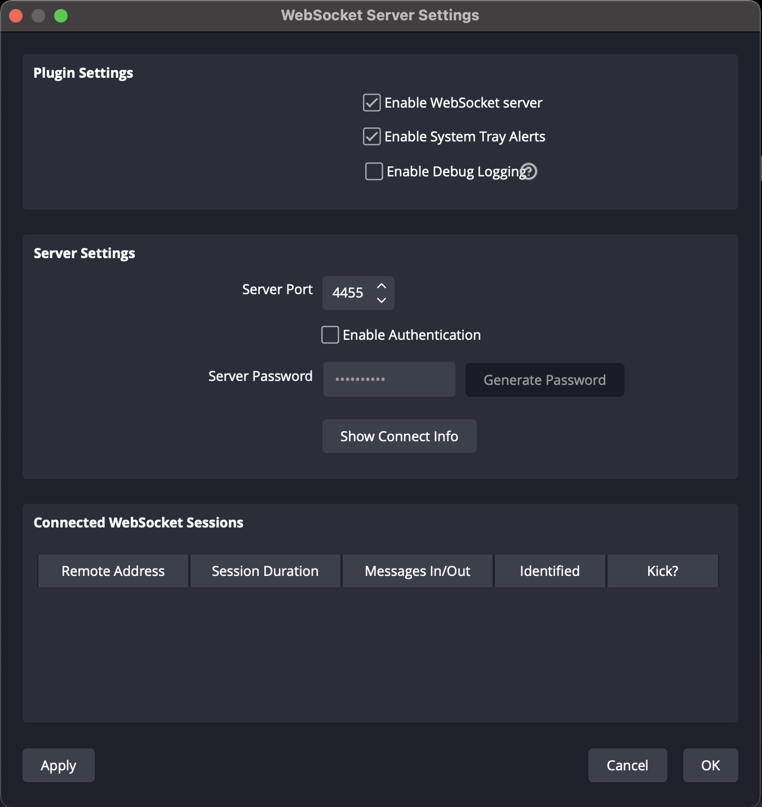

# Clova Speech GRPC Stream

[OBS] (<https://obsproject.com/ko/download>)
[Websocket plugin for OBS] (<https://github.com/obsproject/obs-websocket>)

## Setup

1. [install OBS](https://obsproject.com/ko/download)

2. [install Websocket](https://obsproject.com/ko/download)

3. set textbox 
</img>

4. set websocket plugin 
</img>

5. .env.sample을 참고해서 .env 파일에 사용 가능한 API 키와 obs websocket 설정값들을 넣는다

6. OBS를 실행해놓고 client.py를 실행 한다

## Translate using papago

grpc STT로 들어오는 문자열이 음절 단위의 문자열이고 마침표같은 문장의 끝을 확인할 수 있는 규칙적인 문자열이 없어
음절이 연속된 묵음이 3번 이상 반복되거나, 마침표가 나오면 문장으로 만들어서 파파고 번역기를 통해 번역된 문장을 받는다
